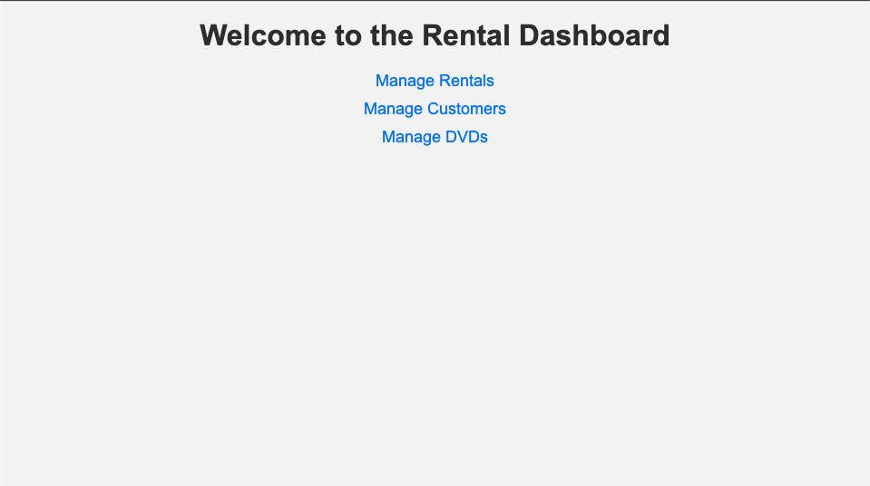
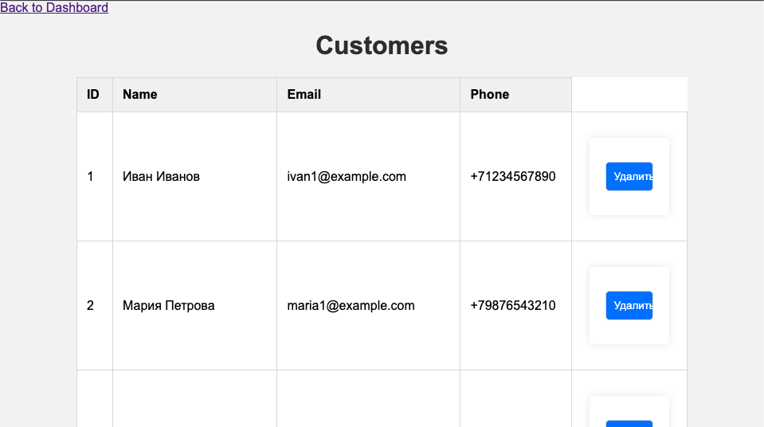
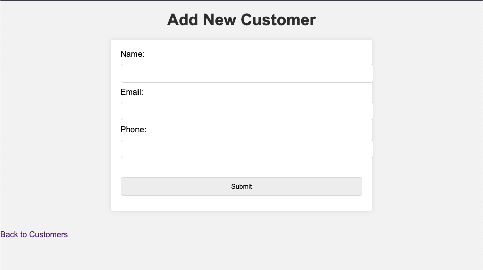
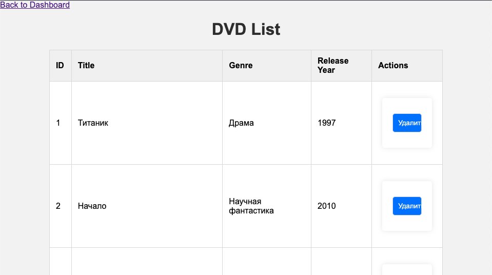
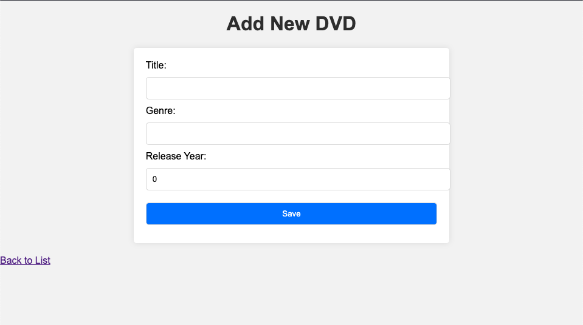
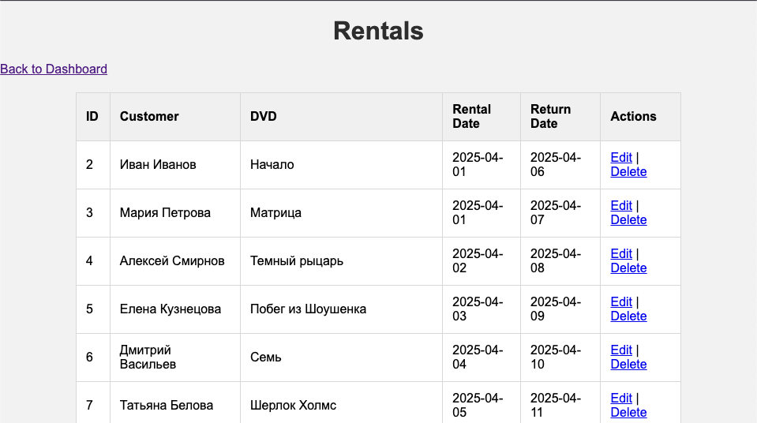
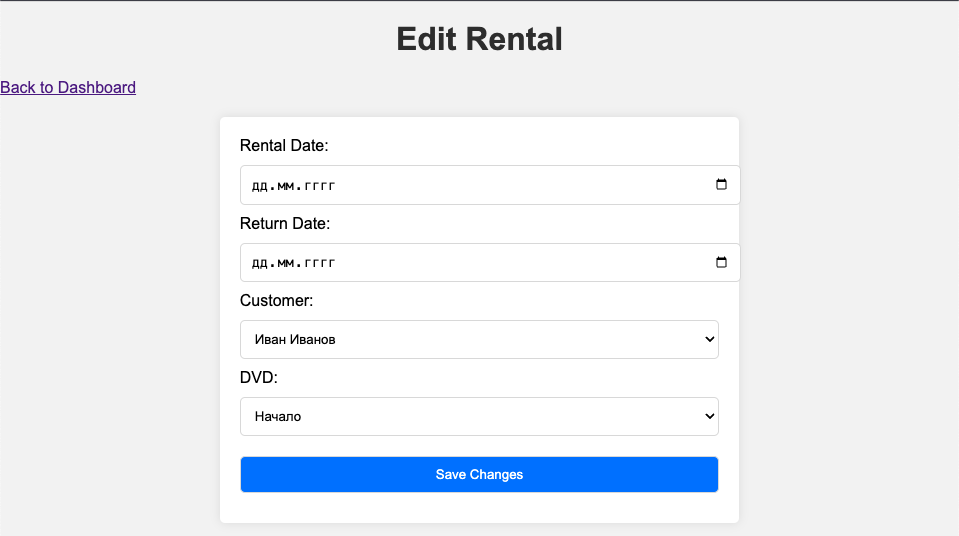

# 🎬 DVD Rental System

Welcome to the **DVD Rental System** — a full-stack Java application that helps manage DVD rentals, customers, and returns. Built with ❤️ using **Spring Boot**, **Thymeleaf**, and **PostgreSQL**.

---

## 🚀 Features

- 📁 Manage DVD catalog (add, edit, delete)
- 👥 Manage customers
- 📦 Track rentals and returns
- 📊 Analyze and optimize SQL queries
- 🖥️ Simple and clean frontend interface (Thymeleaf)
- 📦 REST API structure for future extension

---

## 🛠️ Tech Stack

- **Java 17** ☕
- **Spring Boot** 🔥
- **Spring Data JPA**
- **PostgreSQL** 🐘
- **Thymeleaf** 🧩
- **Gradle** 🧱

---

## 📸 Screenshots
















---


---

## 📋 How to Run

```bash
# Clone the repo
git clone https://github.com/yourusername/DVD-Rental-System.git
cd DVD-Rental-System

# Run the application
./gradlew bootRun
```
Visit http://localhost:8080.home 🌍


##  To Do

- ✅ Backend: DVD & Customer logic
- ✅ Frontend for DVD and Customer management
- ✅ Rental logic and return handling
-   Query optimization & index analysis
-   Finalize README screenshots

MIT License

Copyright (c) 2025 Tamlin7

Permission is hereby granted, free of charge, to any person obtaining a copy
of this software and associated documentation files (the "Software"), to deal
in the Software without restriction, including without limitation the rights
to use, copy, modify, merge, publish, distribute, sublicense, and/or sell
copies of the Software, and to permit persons to whom the Software is
furnished to do so, subject to the following conditions:

The above copyright notice and this permission notice shall be included in
all copies or substantial portions of the Software.

THE SOFTWARE IS PROVIDED "AS IS", WITHOUT WARRANTY OF ANY KIND, EXPRESS OR
IMPLIED, INCLUDING BUT NOT LIMITED TO THE WARRANTIES OF MERCHANTABILITY,
FITNESS FOR A PARTICULAR PURPOSE AND NONINFRINGEMENT. IN NO EVENT SHALL THE
AUTHORS OR COPYRIGHT HOLDERS BE LIABLE FOR ANY CLAIM, DAMAGES OR OTHER
LIABILITY, WHETHER IN AN ACTION OF CONTRACT, TORT OR OTHERWISE, ARISING FROM,
OUT OF OR IN CONNECTION WITH THE SOFTWARE OR THE USE OR OTHER DEALINGS IN
THE SOFTWARE.
